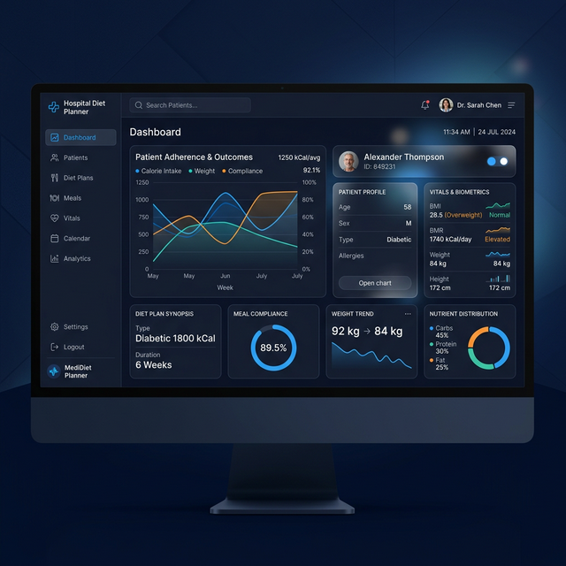

# 🏥 LifeCare: Clinical Nutrition & Diet Planning Command Center



## 🌐 Overview
**LifeCare** is a state-of-the-art Clinical Nutrition management system designed for modern hospitals and wellness centers. It streamlines the entire patient nutritional journey—from initial registration and vitals assessment to automated, scientifically-backed diet generation.

Built with a focus on **Visual Excellence** and **Clinical Precision**, LifeCare eliminates manual error by automating complex metabolic calculations (BMI, BMR, TDEE) while providing a premium, high-performance UI.

---

## 🚀 Key Modules & Features

### � 1. Analytics Hub (Command Center)
- **Live Performance Dashboard:** Real-time system monitoring with a dynamic clock and status indicators.
- **Biometric At-a-Glance:** Instant visibility into patient volumes, daily visits, and BMI distributions.
- **Trend Intelligence:** 6-month visual reporting on patient growth and checkup activity.

### 🩺 2. Precision Patient Management
- **Smart Registration:** Captures Age, Gender, Height, Weight, Activity Level, and Blood Pressure.
- **Metabolic Engine:** Instant calculation of **BMI**, **BMR** (Mifflin-St Jeor), and **TDEE**.
- **Clinical Update (AJAX):** Seamless modal-based updates for existing patients. Search by phone number and update vitals without page reloads.

### � 3. Intelligent Diet Generation
- **Macro-Targeting:** Automatic calorie splits: **50% Carbohydrates, 20% Protein, and 30% Fats**.
- **Meal-Flow Optimization:** Generates specific caloric targets for Breakfast, Lunch, Snacks, and Dinner.
- **Dietary Personalization:** Supports Veg, Non-Veg, Vegan, and Eggetarian preferences across various meal frequencies (3-Meal or 5-Meal plans).

### 🖥️ 4. Premium UX/UI Design
- **Glassmorphic Ecosystem:** A sophisticated dark-navy interface with blur effects and sleek transitions.
- **Responsive Shell:** Fully optimized for both desktop clinical workstations and mobile tablets.
- **Interactive Reports:** Dynamic patient records with color-coded BMI status tags.

---

## 🛠️ Technology Stack

| Component | Technology | Used For |
| :--- | :--- | :--- |
| **Backend** |  | Core Logic & Calculations |
| **Framework** |  | Web Framework & ORM |
| **Database** |  | Lightweight, reliable data storage |
| **Frontend** |   | Semantics & Premium Styling |
| **Scripts** |  | AJAX, Modals, & Real-time Clock |
| **Charts** |  | Clinical Data Visualization |

---

## 📉 Medical Algorithms Used

The system ensures clinical accuracy using globally recognized formulas:

### 1. Basal Metabolic Rate (BMR)
Calculated using the **Mifflin-St Jeor Equation**, currently the most accurate for estimating BMR in clinical settings.
- **Men:** `(10 × weight_kg) + (6.25 × height_cm) - (5 × age_years) + 5`
- **Women:** `(10 × weight_kg) + (6.25 × height_cm) - (5 × age_years) - 161`

### 2. Total Daily Energy Expenditure (TDEE)
Adjusted based on physical activity multipliers:
- **Sedentary:** `BMR × 1.2`
- **Lightly Active:** `BMR × 1.375`
- **Moderately Active:** `BMR × 1.55`
- **Very Active:** `BMR × 1.725`

---

## ⚙️ Installation & Setup

### 1. Clone the Repository
```bash
git clone https://github.com/yourusername/Diet-Planner.git
cd Diet-Planner
```

### 2. Set Up Virtual Environment
```bash
python -m venv venv
# On Windows:
venv\Scripts\activate
# On Mac/Linux:
source venv/bin/activate
```

### 3. Install Dependencies
```bash
pip install -r requirements.txt
```

### 4. Database Migrations
```bash
python manage.py makemigrations
python manage.py migrate
```

### 5. Launch the Server
```bash
python manage.py runserver
```

Visit `http://127.0.0.1:8000/` in your browser.

---

## 📂 Project Structure
```text
Diet-Planner/
├── dietplanner/       # Project configuration (settings, urls, wsgi)
├── health/            # Main application (models, views, urls, migrations)
├── static/            # CSS, Images, and JavaScript assets
├── templates/         # HTML documents (base, home, patient modules)
├── manage.py          # Django management script
└── requirements.txt   # Project dependencies
```

---

## 🛡️ License & Contributing
This project is open-source. Feel free to fork and submit pull requests for any enhancements or bug fixes.

---
*Maintained by the LifeCare Clinical Nutrition Team.*
